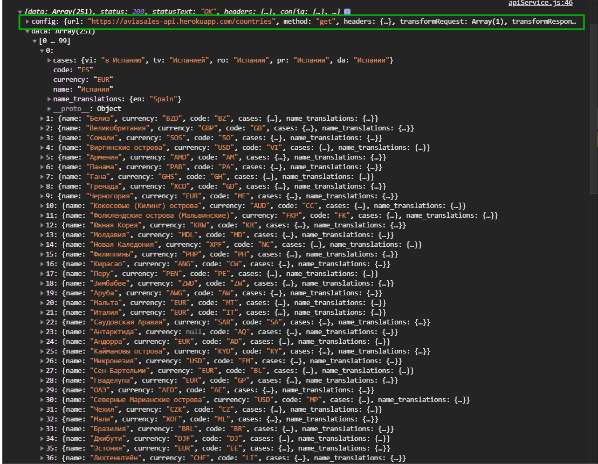

# Начало

Беру два файла

```js
// webpack.config.js
const path = require('path');
const autoprefixer = require('autoprefixer');
const precss = require('precss');
const HtmlWebpackPlugin = require('html-webpack-plugin');
const MiniCssExtractPlugin = require('mini-css-extract-plugin');

module.exports = {
  // Итак,  чтобы вебпак начал свою работу, нужно указать главный (основной) файл, который будет включать в себя все другие необходимые файлы (модули).
  entry: {
    polyfill: 'babel-polyfill',
    app: './js/app.js',
  },
  // Также webpack рекомендует явно указывать, в какой директории находятся исходные файлы проекта (ресурсы). Для этого следует использовать свойство context:
  context: path.resolve(__dirname, 'src'),
  devServer: {
    publicPath: '/',
    port: 9000,
    contentBase: path.join(process.cwd(), 'dist'),
    host: 'localhost',
    historyApiFallback: true,
    noInfo: false,
    stats: 'minimal',
    hot: true,
  },
  module: {
    // Для того, чтобы трансформировать файл, используются специальные утилиты - загрузчики (loaders).
    //Для любых настроек модуля вебпак используется поле module.
    //Массив rules  внутри объекта module определяет список правил для загрузчиков.
    rules: [
      {
        use: {
          loader: 'babel-loader',
          options: {
            presets: ['@babel/preset-env'],
          },
        },
        test: /\.js$/,
      },
      {
        test: /\.css$/,
        use: [
          {
            loader: MiniCssExtractPlugin.loader,
          },
          {
            loader: 'css-loader',

            options: {
              importLoaders: 1,
              sourceMap: true,
            },
          },
          {
            loader: 'postcss-loader',
            options: {
              plugins: () => [precss, autoprefixer],
            },
          },
        ],
      },
      {
        test: /\.(png|jpe?g|gif)$/,
        use: [
          {
            loader: 'file-loader',
            options: {
              name: '[path][name].[ext]',
            },
          },
        ],
      },
    ],
  },
  // Вебпак плагины используются для настройки процесса сборки.
  //Например, плагин для минификации кода (во время сборки код подвергается очистке и минификации).
  //Или плагин для сборки html страницы и css кода (скрипты вставляются в html, куски css собираются в один файл).
  plugins: [
    new MiniCssExtractPlugin({ filename: './style.css' }),
    new HtmlWebpackPlugin({
      template: 'index.html',
    }),
  ],
  // Кроме entry, мы можем указать поле, куда (в какой файл) собирать конечный результат. Это свойство задаётся с помощью поля output.
  //По умолчанию, весь результирующий код собирается в папку dist.
  output: {
    path: path.resolve(__dirname, 'dist'),
    filename: '[name].[hash].js',
  },
  mode: 'development',
};
```

---

```json
{
  "name": "incaps-w-mod",
  "version": "1.0.0",
  "description": "",
  "main": "index.js",
  "scripts": {
    "dev": "webpack-dev-server",
    "build": "webpack"
  },
  "keywords": [],
  "author": "",
  "license": "ISC",
  "devDependencies": {
    "@babel/core": "^7.5.5",
    "@babel/preset-env": "^7.5.5",
    "autoprefixer": "^9.6.1",
    "babel-core": "^6.26.3",
    "babel-loader": "^8.0.6",
    "babel-polyfill": "^6.26.0",
    "css-loader": "^3.1.0",
    "file-loader": "^4.1.0",
    "html-webpack-plugin": "^3.2.0",
    "mini-css-extract-plugin": "^0.8.0",
    "postcss-loader": "^3.0.0",
    "precss": "^4.0.0",
    "style-loader": "^0.23.1",
    "webpack": "^4.39.1",
    "webpack-cli": "^3.3.6",
    "webpack-dev-server": "^3.7.2"
  },
  "dependencies": {
    "axios": "^0.19.0",
    "bootstrap": "^4.3.1"
  }
}
```

И инициализирую проект

```shell
npm i
```

Так же файл **.gitignore**.

Как я сказал нам понадобится плагин **axios** [https://github.com/axios/axios](https://github.com/axios/axios) для того что бы выполнять запросы.

```shell
npm i --save axios
```

Это специальный плагин для того что бы выполнять различные **ajax** запросы. Он имеет довольно широкий функционал с которым мы познакомимся.

В папке **src/js** создаю папку **service** и папку **config**.


В папке **config** создаю файл **apiConfig.js**. В этом файле я создаю объект **const config = {}** и в нем будет пока что одна настройка. Это будет адрес нашего **api** куда мы будем делать запросы.

```js
// apiConfig.js

const config = {
  url: 'https://aviasales-api.herokuapp.com',
};
```

Для того что бы эту конфигурацию потом получить в других файлах мы должны сделать **export.default config;**

```js
// apiConfig.js

const config = {
  url: 'https://aviasales-api.herokuapp.com',
};

export default config;
```

Это нам нужно для того что бы мы могли это переиспользовать. Иметь единое место где мы это можем изменить. **API** в любом случае сменится потому что в процессе development он один, а в **production** он другой.

Теперь в папке **service** создадим новый файл **apiService.js**. Это будет класс с набором методов для взаимодействия с нашим сервером. Для взаимодействия нам понадобится непосредственно **axios**. Импортирую библиотеку **import axios from 'axios';** И далее импортирую конфигурационный файл **api** т.е. **import config from '../config/apiConfig';** Далее создаю **class Api{}**. У этого класса будет **constructor(config){}** который будет принимать **config**. Создавать свойство **this.url = config.url**.

```js
// apiService.js
import axios from 'axios';
import config from '../config/apiConfig';

class Api {
  constructor(config) {
    this.url = config.url;
  }
}
```

Далее я создаю экземпляр этого класса т.е. это у нас будет называться **const api = new Api()** и мы передаем ему при вызове, что бы в конструктор у нас попал **config** мы передаем тот **config** который мы создали.

```js
// apiService.js
import axios from 'axios';
import config from '../config/apiConfig';

class Api {
  constructor(config) {
    this.url = config.url;
  }
}

const api = new Api(config);

export default api;
```

Теперь создав **api** мы его экспортируем.
Т.е. мы с вами создаем некую сущьность. Как я показывал на рисунке это наш **API CERVICE**.


В этот файл импортируются **PLUGINS**. И наш **CONFIG** файл. В **API CERVICE** будет набор методов для работы с сервером. Эти методы в дальнейшем предоставляются нашему **app.js** c которого мы будем управлять и вызывать методы которые нам нужны.

Создадим эти методы. Пока что у нас будут три метода. Наш **API** поддерживает несколько запросов. Он модет вернуть цены на билеты по указанным датам **location** по дате отправления. **Location** откуда отправляешся, в какой город летишь. Со всей этой информацией он может отдать цены. Но для того что бы помимо получения этих цен нам еще с вами нужно иметь возможность, мы же будем выводить пользователю некий **UI**, и он например имеет возможность выбрать город в котором он находится, дату вылета, дату вылета обратно и город куда он летит.

Таким образом сейчас на сервере есть несколько так называемых **end point** это **countries**, **cities**,**prices/cheap**.

**countries** - возвращает массив стран которые поддерживаются потому что мы должны знать из каких стран у нас есть выбор. Реализуем эти три основные метода.

```js
// apiService.js
import axios from 'axios';
import config from '../config/apiConfig';

/*
 /countries - array of countries
 /cities - array of cities
 /prices/cheap - array с доступными рейсами
*/

class Api {
  constructor(config) {
    this.url = config.url;
  },
  countries(){}
  cities(){}
  prices(){}
}

const api = new Api(config);

export default api;

```

метод **prices** пока что единственный который будет принимать разный рабор параметров. Мы к нему вернемся позже когда будем реализовывать **UI** по выбору соответствущих параметров.

В **countries** мы уже будем делать запрос на сервер. В этом методе делаю конструкцию **try catch**. Внутри я буду получать **const responce = await axios.get()** он принимает **url** и конфигурацию. Конфига у нас никакого не будет, у нас будет только **'\${this.url}'** это то что мы получили на фход с нашего **config**. И после еще указываю **/countries**.

Получив ответ, давайте его будем выводить в консоль. В **catch** помимо вывода ошибки буду делать еще **return.Promise.reject(err);**

Похожая ситуация у нас будет в **cities** только на другой адрес.

```js
// apiService.js
import axios from 'axios';
import config from '../config/apiConfig';

/*
 /countries - array of countries
 /cities - array of cities
 /prices/cheap - array с доступными рейсами
*/

class Api {
  constructor(config) {
    this.url = config.url;
  }

  async countries() {
    try {
      const response = await axios.get(`${this.url}/countries`);
      console.log(response);
    } catch (error) {
      console.log(error);
      return Promise.reject(err);
    }
  }
  async cities() {
    try {
      const response = await axios.get(`${this.url}/cities`);
      console.log(response);
    } catch (error) {
      console.log(error);
      return Promise.reject(err);
    }
  }
  async prices() {}
}

const api = new Api(config);

export default api;
```

Теперь импортирую этот модуль в **app.js**

```js
// app.js
import api from './service/apiService';
```

И пробуем делать **api.countries().then(res => console.log(res))**

```js
// app.js
import api from './service/apiService';

api.countries().then((res) => console.log(res));
```

И запускаю

```shell
npm run dev
```


И вот я получаю массив. **Undefined** я получаю потому что вот здесь **api.countries().then((res) => console.log(res));** я консолю результат которого нет.


Здесь есть **data**. Как видите **axios** возвращает немного в другом формате в отличие от **fetch**. В **data** находится массив с нашими странами.


Каждая страна имеет код, валюту и непосредственно название.




Как видите **url** строка куда был отправлен запрс.

Мы эти данные будем в дальнейшем использовать для вывода в **select** что бы пользователь мог выбрать нужную ему страну при этом **select** будет с автопоиском. Теперь вместо **console.log(response);** пишу **return response.data**.

```js
// apiService.js
import axios from 'axios';
import config from '../config/apiConfig';

/*
 /countries - array of countries
 /cities - array of cities
 /prices/cheap - array с доступными рейсами
*/

class Api {
  constructor(config) {
    this.url = config.url;
  }

  async countries() {
    try {
      const response = await axios.get(`${this.url}/countries`);
      return response.data;
    } catch (error) {
      console.log(error);
      return Promise.reject(err);
    }
  }
  async cities() {
    try {
      const response = await axios.get(`${this.url}/cities`);
      return response.data;
    } catch (error) {
      console.log(error);
      return Promise.reject(err);
    }
  }
  async prices() {}
}

const api = new Api(config);

export default api;
```

И теперь проверяю что они оба работают

```js
// app.js
import api from './service/apiService';

api.countries().then((res) => console.log(res));
api.cities().then((res) => console.log(res));
```


