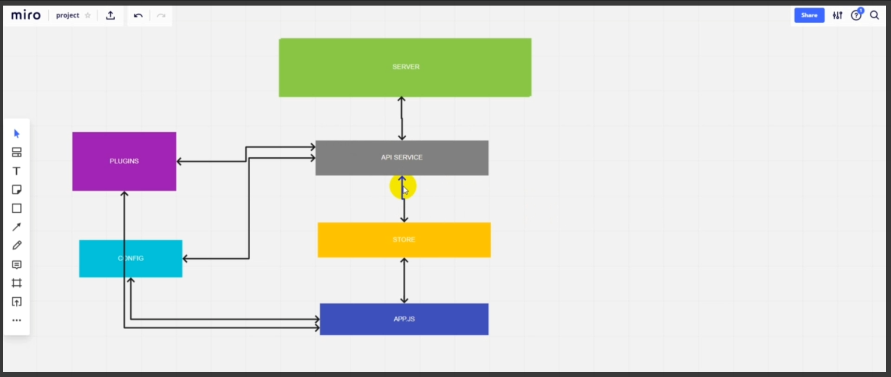
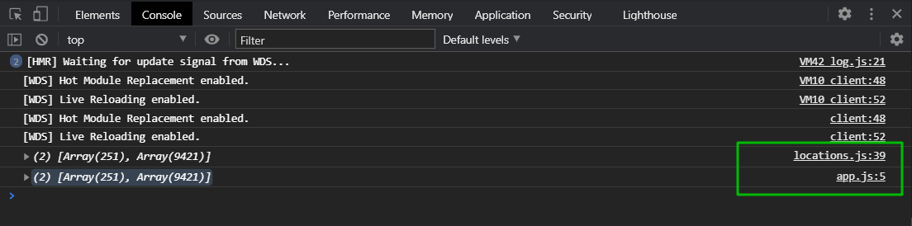
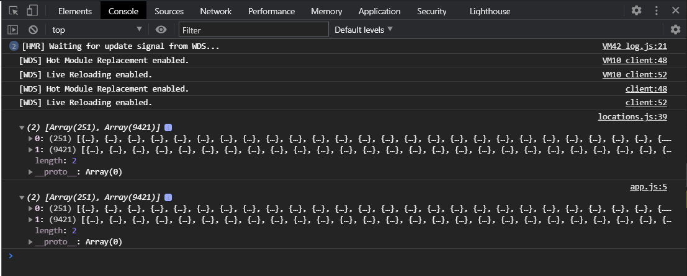
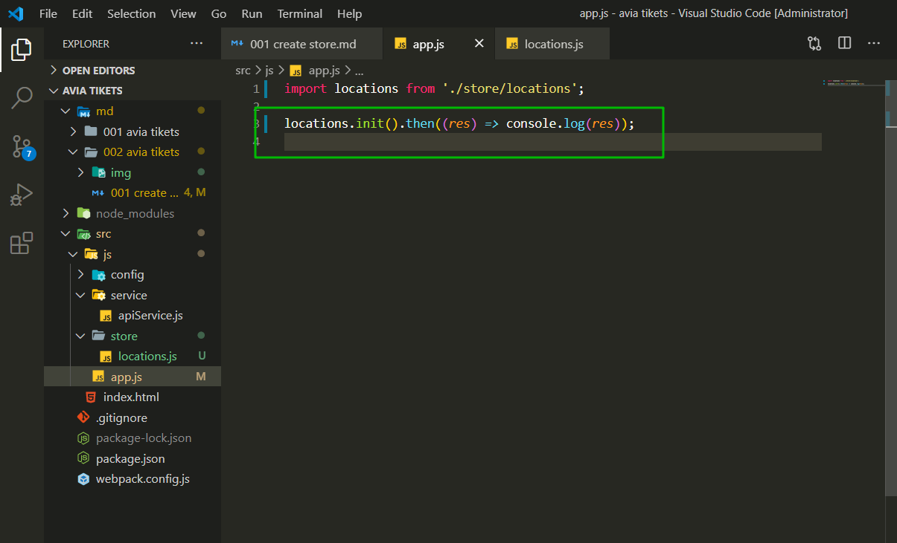
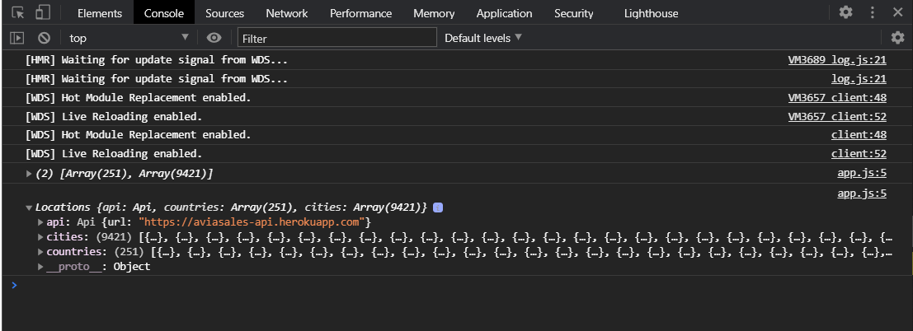
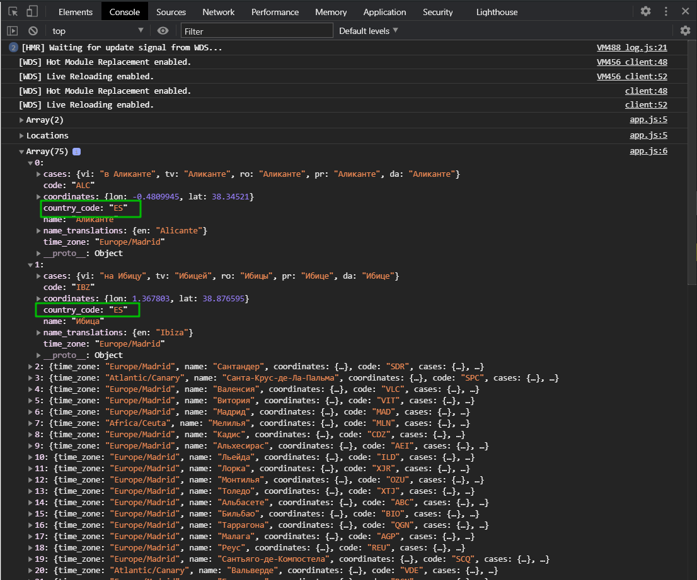

# Создание хранилища.

**Store** обычно присутствует в любых **framework**. В **Angular** это **Ngrx**, во **View** это **Viewx** (Вроде так). Это так называемый единый источник данных в котором храниться какое-то состояние данных всего нашего приложения. Опять же этих хранилищ может быть много. Они так же делятся по сущностям в зависимости от того какие данные они хранят. Например там о пользователе. В данной ситуации у нас будет **store** для хранения **location** т.е. это **countries** и **sities** города и страны которые мы получили от сервера.

Зачем нам это нужно? Для того что бы потом любая часть нашего приложения имела единый источник из которого она будет брать текущие данные с которыми она будет работать. Например массив нашах городов и стран. Потому что у нас в дальнейшем может быть не один файл **app.js**, а множество. Это мы будем говорить когда будем реализовывать компоненты. Каждый из компонентов может иметь доступ к **store** и получать из него всегда обновленные данные. Так же из **store** будет идти непосредственно связь с нашим **API SERVICE**.



Реализую хранилище. Для этого я создаю отдельную папку под названием store и в ней создаю файл **locations.js**.

В **locations.js** мы импортируем наш **api**.

```js
// locations.js
import api from '../service/apiService';
```

И что здесь будет происходить. Дело в том что нам нужно сразу получить и города и страны т.е.

```js
// apiService.js
import axios from 'axios';
import config from '../config/apiConfig';

/*
 /countries - array of countries
 /cities - array of cities
 /prices/cheap - array с доступными рейсами
*/

class Api {
  constructor(config) {
    this.url = config.url;
  }

  async countries() {
    try {
      const response = await axios.get(`${this.url}/countries`);
      return response.data;
    } catch (error) {
      console.log(error);
      return Promise.reject(err);
    }
  }
  async cities() {
    try {
      const response = await axios.get(`${this.url}/cities`);
      return response.data;
    } catch (error) {
      console.log(error);
      return Promise.reject(err);
    }
  }
  async prices() {}
}

const api = new Api(config);

export default api;
```

т.е. при загрузке нашего приложения нам нужно будет сразу получить и то и другое и сохранить это внутри нашего приложения. Для этого мы как раз таки формируем **store**. **Store** будет представлен ввиде класса, хотя он может быть представлен и ввиде объекта. **class Locations{}** у него будет так же **constructor(api){}** который будет принимать экземпляр класса **api**. И в теля конструктора я его буду сохранять.

```js
// locations.js
import api from '../service/apiService';

class Locations {
  constructor(api) {
    this.api = api;
  }
}
```

Так же у нас здесь будет свойство **this.countries = null;** которое будет на старте **null**. И у нас будет **this.cities = null;** который так же будет на старте **null**.

```js
// locations.js
import api from '../service/apiService';

class Locations {
  constructor(api) {
    this.api = api;
    this.countries = null;
    this.cities = null;
  }
}
```

Далее мы будем так же как с **api** формировать новый экземпляр **const locations = new Locations(api);** и передавать туда **api**. И **export default locations;**

```js
// locations.js
import api from '../service/apiService';

class Locations {
  constructor(api) {
    this.api = api;
    this.countries = null;
    this.cities = null;
  }
}

const locations = new Locations(api);

export default locations;
```

Теперь наш **app.js** нужно изменить. Теперь **app.js** взаимодействует не напрямую с **apiService**

```js
// app.js
import api from './service/apiService';

api.countries().then((res) => console.log(res));
api.cities().then((res) => console.log(res));
```

А будет взаимодействовать со **store** т.к. пока что **app.js** является нашим единственным компонентом который будет взаимодействовать с разметкой и соответственно получать какие-то данные из **store**.

Для этого в **store/locations.js** я создаю метод **async init(){}**. В этом методе я сделаю следующие действия. Мы запросим сразуже города и страны у нашего **api service**. Для этого я создаю переменную **const response = await Promice.all. Promice.all** я использую для выполнения сразу нескольких асинхронных операций. **Promice.all([])** выполняю первую асинхронную операцию это получаю города **this.api.countries()** и вторую получаю города **this.api.cities()**.

```js
// locations.js
import api from '../service/apiService';

class Locations {
  constructor(api) {
    this.api = api;
    this.countries = null;
    this.cities = null;
  }
  async init() {
    const response = await Promise.all([
      this.api.countries(),
      this.api.cities(),
    ]);
    console.log(response);
    return response; // обязательно возвращаю ответ
  }
}

const locations = new Locations(api);

export default locations;
```

Теперь перехожу в app.js и меняю то что я там писал на.

```js
import locations from './store/locations';

locations.init().then((res) => console.log(res));
```

И теперь как мы видим мы получаем в **app.js** и в **locations.js**.



Один со странами а другой с городами.



Таким образом я в **app.js** вызываю не два метода а один.



Плюс в **locations.js** я сейчас добавлю дополнительный функционал который мне нужен. Мне нужно непосредственно разделить на страны и города наш **response** т.е. **const [countries, cities] = response;** И внутри нашего класса сохранить **this.countries = countries;** которые мы получили. И сохранить города **this.cities = cities;**

Теперь у нас будет единое место.

```js
// locations.js
import api from '../service/apiService';

class Locations {
  constructor(api) {
    this.api = api;
    this.countries = null;
    this.cities = null;
  }
  async init() {
    const response = await Promise.all([
      this.api.countries(),
      this.api.cities(),
    ]);
    const [countries, cities] = response;
    this.countries = countries;
    this.cities = cities;
    return response; // обязательно возвращаю ответ
  }
}

const locations = new Locations(api);

export default locations;
```

Мы можем перейти в наш **app.js** В котором я могу законсолить **res** и после этого так же законсолить **locations**.

```js
import locations from './store/locations';

locations.init().then((res) => {
  console.log(res), console.log(locations);
});
```

И теперь мы с вами можем увидить что в **location** у нас есть раздел **cities** где все города и раздел **countries** где все страны.



Т.е. я теперь имею доступ к этим свойствам **countries** и **cities**. Теперь я могу получить текущее положение стран и городов которое у нас есть.

Теперь давайте в **locations.js** добавим дополнительный метод который нам понадобится. Это получение городов по коду страны.

Т.е. **store** у нас в данном случае выступает как источник работы с данными которые у нас есть внутри приложения. Так же он **store** выступает посредником коммуникации с **api**. **api** это лишт набор методов для взаимодействия с сервером.

Как вы видите нам иногда нужно взаимодействовать с методами, либо несколько их вызвать. Мы в будущем наверное добавим функционал что возможно нужно изменить структуру данных которую мы получили от сервера и т.д. Такам образом нам это нужно обернуть в **store** в хранилище в котором у нас это будет лежать и выполняться.

Теперь в **locations.js** я добавляю метод **getCitiesByCountryCode(code){}** этот метод будет принимать **code**. И он нам будет возвращать **return this.cities.filter()** т.е. мы будем фильтровать города по странам. Забегая на перед в будущем мы это немного изменим. Соответственно мы будем на каждой итерации фильтра получать один город **city =>** мы будем у него проверять свойство **city.country_code** и что данное свойство эквивалентно тому коду который передали. И оно будет возвращать новый массив.

```js
// locations.js
import api from '../service/apiService';

class Locations {
  constructor(api) {
    this.api = api;
    this.countries = null;
    this.cities = null;
  }
  async init() {
    const response = await Promise.all([
      this.api.countries(),
      this.api.cities(),
    ]);
    const [countries, cities] = response;
    this.countries = countries;
    this.cities = cities;
    return response; // обязательно возвращаю ответ
  }
  getCitiesByCountryCode(code) {
    return this.cities.filter((city) => city.country_code === code);
  }
}

const locations = new Locations(api);

export default locations;
```

Вызываю данный метод. Беру из консоли любой код страны. К примеру Испанию **"ES"**. И в **app.js** вызываю данную страну.

```js
import locations from './store/locations';

locations.init().then((res) => {
  console.log(res), console.log(locations);
  locations.getCitiesByCountryCode('ES');
});
```

И выведу это в консоль.

```js
import locations from './store/locations';

locations.init().then((res) => {
  console.log(res), console.log(locations);
  console.log(locations.getCitiesByCountryCode('ES'));
});
```


И вот я получаю **75** городов у соторых **country_code ES**.



Таким образом у пользователя будет возможность в **select** выбрать его страну в будущем и мы сформируем ему данные для нового **select** где будут все города по этой стране.

Резюмирую. Я создал **store**. Он выступает как единственный источник данных для нашего приложения. Хранилищ **store** может быть много в зависимости от сущностей. Под каждую сущность отдельное хранилище. У вас даже могут на собеседовании задать такой вопрос о том что представте что у вас есть какой-то **API**, он состоит из множества **services** в том числе разбито на различные сервисы которые обслуживают отдельную логику, часть приложения, то как вы будете формировать свое приложение? и как раз таки речь идет о том что у вас должно быть разбиение на множество, количество хранилищ **store**, или сервисов внутри вашего **front-end** приложения в котором вы будете обслуживать какую-то часть данных для этого приложения. В данном случае у меня есть **store** который обслуживает часть связанную с городами и странами. Ч то бы в се части приложения в дальнейшем имели доступ к store и могли от туда брать актуальные данные.
