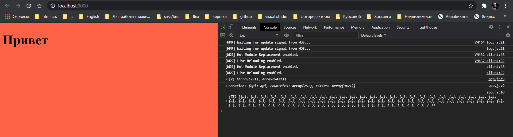
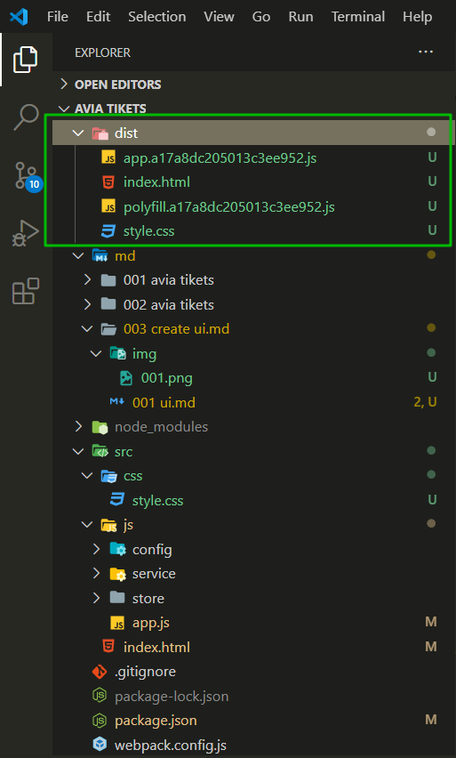
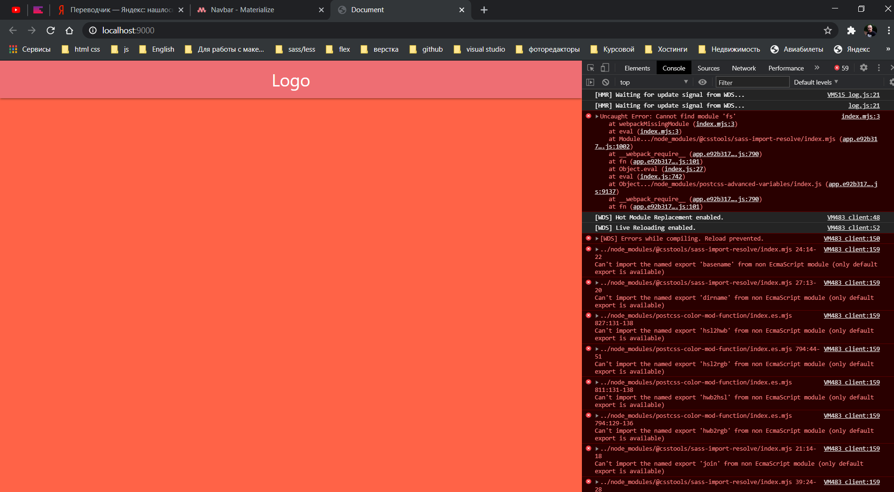

# Создание UI для формы.

Для того что бы продолжить нам нужно внести изменения в наш webpack.config.js точнее изменения для работы со стилями. Для того что бы у нас при создании build генерировался файл со стилями и подключался, нам нужно установить дополнительный плагин

```shell
 npm i --save-dev mini-css-extract-plugin
```

Дописываю в webpack.config.js что мне нужно. мне нужно объявить переменную которая будет называться **const MiniCssExtractPlugin = require('mini-css-extract-plugin');**.

Далее мне нужно опуститься в rules и в loader(загрузчик) вместо style-loader указать MiniCssExtractPlugin.loader.

Так же нужно опуститься к plugins и добавить new MiniCssExtractPlugin({ filename: './style.css' }), где указываю под каким файлом у нас будут выводится стили.

Это нам нужно для того что бы наши стили правильно подключались.

```js
// webpack.config.js
const path = require('path');
const autoprefixer = require('autoprefixer');
const precss = require('precss');
const HtmlWebpackPlugin = require('html-webpack-plugin');
const MiniCssExtractPlugin = require('mini-css-extract-plugin');

module.exports = {
  // Итак,  чтобы вебпак начал свою работу, нужно указать главный (основной) файл, который будет включать в себя все другие необходимые файлы (модули).
  entry: {
    polyfill: 'babel-polyfill',
    app: './js/app.js',
  },
  // Также webpack рекомендует явно указывать, в какой директории находятся исходные файлы проекта (ресурсы). Для этого следует использовать свойство context:
  context: path.resolve(__dirname, 'src'),
  devServer: {
    publicPath: '/',
    port: 9000,
    contentBase: path.join(process.cwd(), 'dist'),
    host: 'localhost',
    historyApiFallback: true,
    noInfo: false,
    stats: 'minimal',
    hot: true,
  },
  module: {
    // Для того, чтобы трансформировать файл, используются специальные утилиты - загрузчики (loaders).
    //Для любых настроек модуля вебпак используется поле module.
    //Массив rules  внутри объекта module определяет список правил для загрузчиков.
    rules: [
      {
        use: {
          loader: 'babel-loader',
          options: {
            presets: ['@babel/preset-env'],
          },
        },
        test: /\.js$/,
      },
      {
        test: /\.css$/,
        use: [
          {
            loader: MiniCssExtractPlugin.loader,
          },
          {
            loader: 'css-loader',

            options: {
              importLoaders: 1,
              sourceMap: true,
            },
          },
          {
            loader: 'postcss-loader',
            options: {
              plugins: () => [precss, autoprefixer],
            },
          },
        ],
      },
      {
        test: /\.(png|jpe?g|gif)$/,
        use: [
          {
            loader: 'file-loader',
            options: {
              name: '[path][name].[ext]',
            },
          },
        ],
      },
    ],
  },
  // Вебпак плагины используются для настройки процесса сборки.
  //Например, плагин для минификации кода (во время сборки код подвергается очистке и минификации).
  //Или плагин для сборки html страницы и css кода (скрипты вставляются в html, куски css собираются в один файл).
  plugins: [
    new MiniCssExtractPlugin({ filename: './style.css' }),
    new HtmlWebpackPlugin({
      template: 'index.html',
    }),
  ],
  // Кроме entry, мы можем указать поле, куда (в какой файл) собирать конечный результат. Это свойство задаётся с помощью поля output.
  //По умолчанию, весь результирующий код собирается в папку dist.
  output: {
    path: path.resolve(__dirname, 'dist'),
    filename: '[name].[hash].js',
  },
  mode: 'development',
};
```

Теперь проверяю что это работает. В папке src создаю папку css и в ней создаю файл style.css.

```css
/* css/style.css  */
body {
  font-size: 20px;
  background-color: tomato;
}
```

Далее импортирую эти стили в app.js

```js
// app.js
import '../css/style.css';
import locations from './store/locations';

locations.init().then((res) => {
  console.log(res), console.log(locations);
  console.log(locations.getCitiesByCountryCode('ES'));
});
```

Запускаю проект и смотрю.



Теперь делаю

```shell
npm run build
```



style.css был автоматически подключен в dist/index.html

```html
<!DOCTYPE html>
<html lang="en">
  <head>
    <meta charset="UTF-8" />
    <meta name="viewport" content="width=device-width, initial-scale=1.0" />
    <title>Document</title>
    <link href="./style.css" rel="stylesheet" />
  </head>
  <body>
    <h1>Привет</h1>
    <script
      type="text/javascript"
      src="polyfill.a17a8dc205013c3ee952.js"
    ></script>
    <script type="text/javascript" src="app.a17a8dc205013c3ee952.js"></script>
  </body>
</html>
```

Для роботы над этим проектом я буду использоветь **materialize** [https://materializecss.com/](https://materializecss.com/). Я его выбрал по причине того что у него есть autocomplete(функция автозаполнения). И плюс у него есть **Pickers** [https://materializecss.com/pickers.html](https://materializecss.com/pickers.html) как Date Picker(выбор даты) так и Time Picker(выбор времени). Хотя недостаток в этом framework что они до сих пор используют float. Тем не менее я его буду оиспользовать потому что у него есть достаточно обширный набор плагинов.

Нам его нужно установить в рамках проекта.

```shell
npm i --save  materialize-css@next
```

После установки его нужно подключить. Для того что бы его подключить в папке js создаю папку plugins там будут плагины. Они требуют инициализации, запуска. Нам нужно что бы наш сборщик понимал с чего наше приложение build. Соответственно нужно импортировать из frameworks materialize стили и js файл. Но так как это сделано изначально для того что бы это можно было просто скачать мы соответственно будем его подключать именно те файлы которые содержаться в materialize js и css файлы. Хотя на самом деле в materialize можно по отдельности в часте и js плагинов подключить что бы не подключать весь файл materialize. Мы пока подключим весь файл.

В папке plugins я создаю два файла index.js а второй файл materialize.js

```js
// plugins/materialize.js
import 'materialize-css/dist/css/materialize.min.css';
import 'materialize-css/dist/js/materialize.min.js';
/*Данные подключения беруться из папки node_modules*/
```

И подключаю в главный файл модуля

```js
const index = require('precss');

// plugins/index.js
import './materialize.js';
```

Теперь в app.js импортирую плагин. Мы не указываем на прямую index.js, просто указываю папку plugins по умолчанию будет искаться index.js и подключаться.

теперь у нас все будет импортироваться и запускаться.

```js
// app.js
import '../css/style.css';
import './plugins';
import locations from './store/locations';

locations.init().then((res) => {
  console.log(res), console.log(locations);
  console.log(locations.getCitiesByCountryCode('ES'));
});
```

Добавляю navbar и разберись с ошибками.


